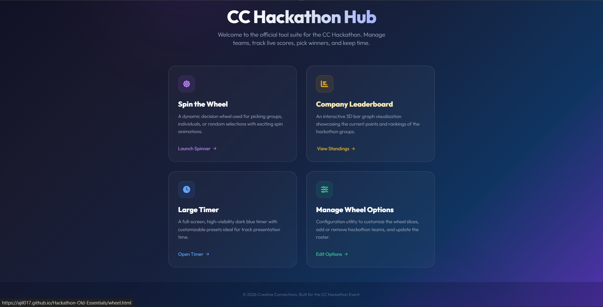
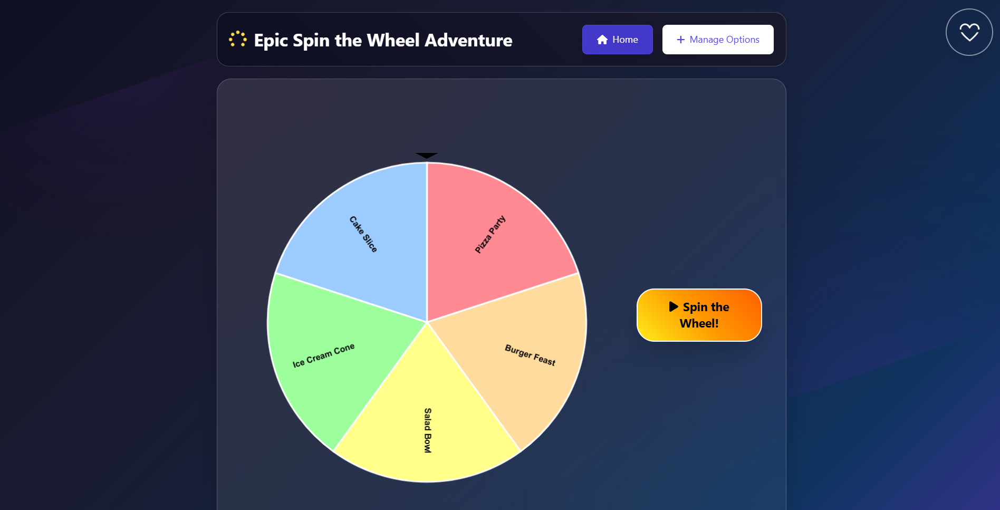
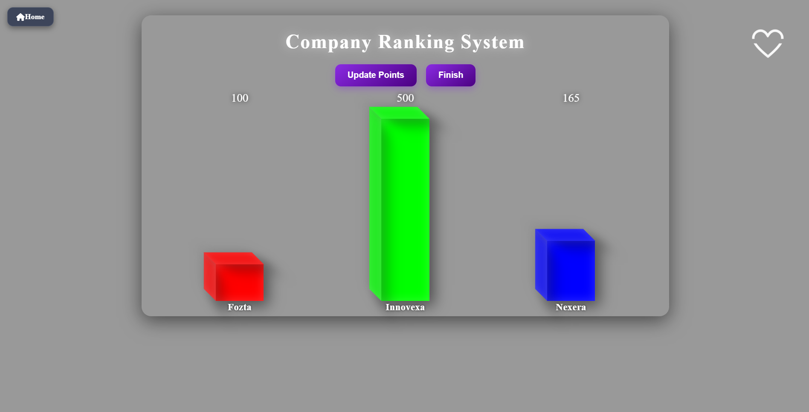
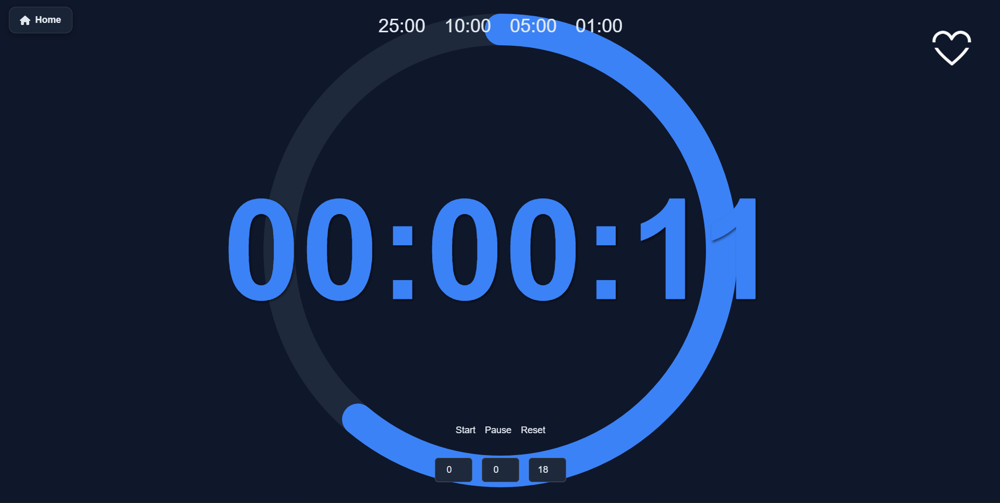
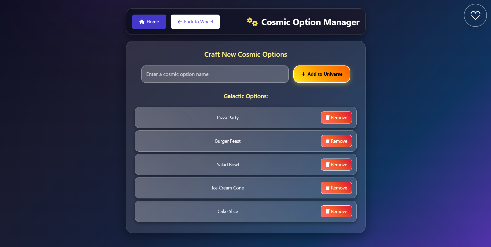

# 🌟 CC Hackathon Old Essentials

Welcome to **CC Hackathon Old Essentials** — the original, lightweight suite of tools designed to manage and run hackathon events smoothly. It features a decision wheel, a point tracker leaderboard, a fullscreen timer, and a newly integrated central landing page to navigate between them.

---

> [!NOTE]  
> This suite was originally built during the initial hackathon phases on **10/09/2025**. It has since been modernized and rewritten. You can find the updated, production-ready version of these tools in my other repository:  
> 👉 **[Random Picker Repository](https://github.com/Ajil017/Random-picker-.git)**
> 👉 **[Timer Repository](https://github.com/Ajil017/Timer-for-events.git)**
---

## 🚀 Features Included

The suite is comprised of the following tools:

### 1. 🎛️ Central Portal (`index.html`)
A responsive, modern dashboard with a glassmorphic layout, glowing hover indicators, and animated background particles. This serves as the central hub to access all files.


### 2. 🎡 Spin the Wheel (`wheel.html`)
An animated picker wheel used to select groups or individuals at random. It reads configuration from local storage and features interactive particle feedback on selection.


### 3. 📊 3D Company Ranking (`cc rank.html`)
An interactive, isometric 3D bar graph visualization for tracking points for hackathon teams (**Fozta**, **Innovexa**, and **Nexera**). Includes an admin control modal to adjust points dynamically.


### 4. ⏱️ Large Timer (`timer.html`)
A high-visibility fullscreen navy-blue countdown timer with quick-preset options (25m, 10m, 5m, 1m). Features a circular progress bar and automated visual warnings for the final 10 seconds.



### 5. 🛠️ Option Manager (`add-options.html`)
Configuration utility to add or remove options from the picker wheel pool, persisting choices inside browser `localStorage`.


---

## 🛠️ Technology Stack
* **Markup**: HTML5 (Semantic Structure)
* **Styling**: Vanilla CSS3, Tailwind CSS (via CDN)
* **Icons & Fonts**: FontAwesome v6.4.0, Google Fonts (Outfit, Inter)
* **Logic**: Vanilla JavaScript (Canvas APIs, 3D CSS transforms, LocalStorage API)

---

## 💻 How to Run

Since the project is built entirely on client-side technologies, you can run it without complex installations:

### Option 1: Direct Launch
1. Open the project folder on your computer.
2. Double-click [index.html](file:///c:/Users/rajup/OneDrive/Desktop/CC/git/index.html) to launch the landing page in your default browser.

### Option 2: Run a Local HTTP Server
If you prefer hosting it locally, run this command in the project directory:
```bash
# Using Python
python -m http.server 8000
```
Then navigate to `http://localhost:8000/index.html` in your browser.

---

## 👤 Author
* **GitHub**: [@Ajil017](https://github.com/Ajil017)
